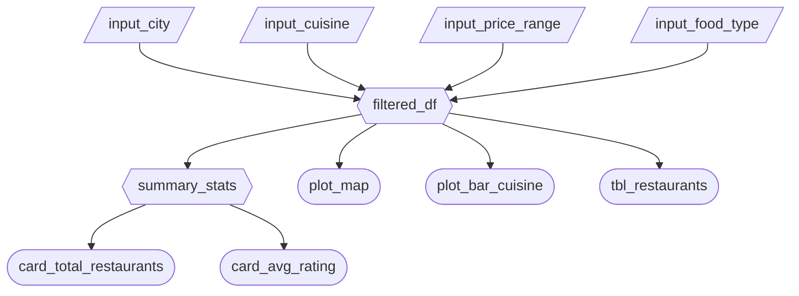

# App Specification

## 2.1 Updated Job Stories

| # | Job Story | Status | Notes |
|---|-----------|--------|-------|
| 1 | When I am evaluating potential restaurant locations across the main Canadian cities, I want to compare and visualize restaurant density so I can avoid opening a restuarant in saturated areas. | ✅ Implemented| Original M1 story is still relevant  |
| 2 | When I am developing a pricing strategy for the city of Vancouver, I want to analyze restaurants' price ranges and performance so I can create a competitive pricing strategy | 🔄 Revised | Added performance analysis to clarify the average ratings card in M2 |
| 3 | When I am deciding what type of restaurant to open, I want to analyze the distribution of different cuisine types so I can identify underserved markets | ✅ Implemented | Original M1 story is still relevant |

## 2.2 Component Inventory

The following table describes every input, reactive calc, and output the Foodlytics app will have.

| ID | Type | Shiny widget / renderer | Depends on | Job story |
|----|------|-------------------------|------------|------------|
| input_city | Input | `ui.input_select()` | — | #1, #2 #3|
| input_cuisine | Input | `ui.input_select()` | — | #1 #3|
| input_price_range | Input | `ui.input_checkbox_group()` | — | #2|
| input_food_type | Input | `ui.input_select()` | — | #3|
| filtered_df | Reactive calc | `@reactive.calc` | input_city, input_cuisine, input_price_range, input_food_type | #1, #2, #3 |
| summary_stats | Reactive calc | `@reactive.calc` | filtered_df | #1, #2 |
| card_total_restaurants | Output | `render.ui()` | summary_stats | #1|
| card_avg_rating | Output | `render.ui()` | summary_stats | #2|
| plot_bar_cuisine | Output | `@render.plot` | filtered_df | #3 |
| plot_map | Output | `@render.plot` | filtered_df | #1 |
| tbl_restaurants | Output | `@render.data_frame` | filtered_df | #2 |

## 2.3 Reactivity Diagram

Below is the planned reactive graph for the Foodlytics app, displayed as a Mermaid flowchart.

## 2.4 Calculation Details

There are two `@reactive.calc` used in the Foodlytics app:

- `filtered_df`
- `summary_stats`

### 1. `filtered_df`

- **Depends on:** `input_city`, `input_cuisine`, `input_price_range`, `input_food_type`
- **Transformation:** Filters rows based on the selected city, price range and cuisine type.
- **Consumed by:** `summary_stats`, `plot_bar_cuisine`, `plot_map`, `tbl_restaurants`

This reactive calculation ensures that all outputs update consistently whenever a user modifies a filter.

### 2. `summary_stats`

- **Depends on:** `filtered_df`
- **Transformation:** Computes aggregate metrics from the filtered dataset, including:
  1. Total number of restaurants  
  2. Average restaurant rating
- **Consumed by:** `card_total_restaurants`, `card_avg_rating`

This reactive calculation performs summary computations so that both statistic cards update efficiently.
